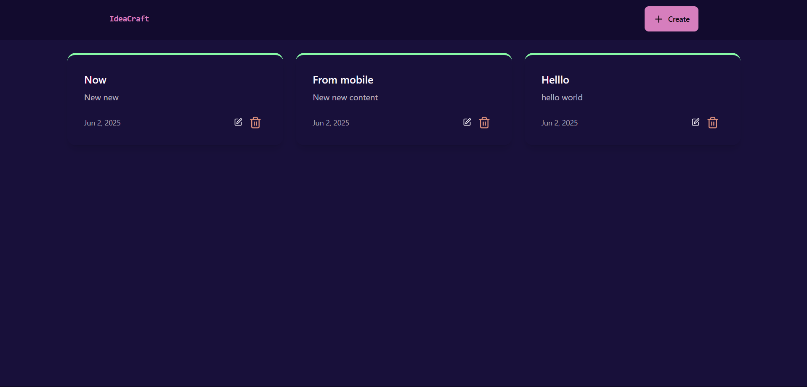

# 💡 IdeaCraft - Note Making Web App

**IdeaCraft** is a full-stack **MERN** (MongoDB, Express.js, React.js, Node.js) application that allows users to create, update, and delete personal notes efficiently. The app features a **modern, responsive UI** built with **DaisyUI** and **Tailwind CSS**, ensuring a seamless experience across both PC and mobile devices.

---

## 🚀 Features

- ✍️ **Create Notes** – Easily add new ideas, tasks, or thoughts.
- 📖 **Read Notes** – View your saved notes with a clean, readable interface.
- 📝 **Update Notes** – Make changes to existing notes anytime.
- ❌ **Delete Notes** – Remove notes you no longer need with a single click.
- 📱 **Responsive Design** – Optimized for desktops, tablets, and mobile screens.
- 🎨 **DaisyUI Styling** – Beautiful and customizable UI components for better UX.

---

## 🛠️ Tech Stack

| Tech        | Usage                         |
|-------------|-------------------------------|
| MongoDB     | Database for storing notes     |
| Express.js  | Backend framework              |
| React.js    | Frontend framework             |
| Node.js     | Server-side runtime            |
| DaisyUI     | Tailwind CSS-based UI styling |
| Render.com  | Cloud hosting platform         |

---

## 🌐 Live Website

👉 [Click here to view the live site](https://ideacraft-application.onrender.com)  

---

## 🖼️ GUI Screenshots

> Below are some screenshots of the IdeaCraft UI across different devices:

### 💻 Desktop View

### 📝 Create Note Modal

---

## 📄 License

This project is licensed under the **MIT License**.  
You are free to use, modify, and distribute this software with proper attribution.

Read the full license in the [LICENSE](./LICENSE) file.

---

## 🙋‍♂️ Credits

Created and maintained by Souhardya Saha.  
Feel free to reach out or connect via:

- 💼 [LinkedIn](www.linkedin.com/in/souhardyasaha)
- 💻 [GitHub](https://github.com/souhardyaCodes24)

---

> IdeaCraft is built with 💙 to help you capture ideas effortlessly!
